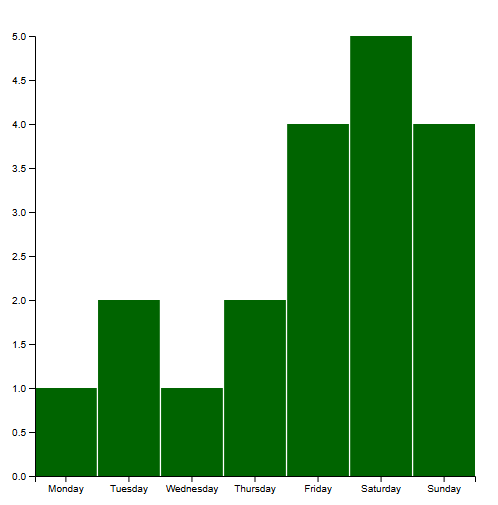

# D3 HW1

## Visualization

## Overview

This bar chart displays the number of hours spent gaming each day of the week for the first week of May. The data is an estimate of my gaming hours each day last week entered manually in Excel, then saved as a CSV for loading into D3.

The dataset has 7 entries for each day, with hours ranging from 1 on busy weekdays to all the way to 5 on Saturday. The weekly average is around 2.7 hours per day. The chart uses a band scale on the x-axis for the categorical days and a linear scale on the y-axis for the hour values, pretty in-line with the provided bar code.