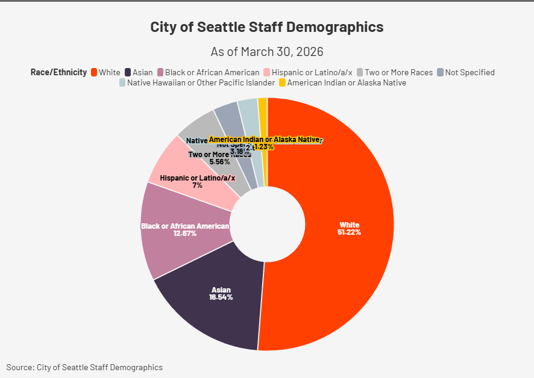

# Flourish 2

## Visualization

## Overview

This visualization uses the City of Seattle Staff Demographics dataset to show how the city categorizes employee race and ethnicity. 

I made the chart messy, to emphasize overlap on the smaller marginalized categories which fight for limited space they have.

The dataset relies on broad, job‑application style categories that vary in specificity. Labels like “Asian,” “Two or More Races,” and “Not Specified” vaguely group very different identities together, which limits how much detail or nuance the data can provide.

The chart also shows a skewed distribution, with some categories representing very small portions of the workforce. This highlights how the dataset’s structure restricts deeper demographic analysis.

## Links

- Link to Flourish Visual: https://public.flourish.studio/visualisation/28657116/

- Link to Data Source: https://data.seattle.gov/City-Administration/City-of-Seattle-Staff-Demographics/5avq-r9hj/about_data

## Citation

City of Seattle. *City of Seattle Staff Demographics*. Seattle Open Data Portal.