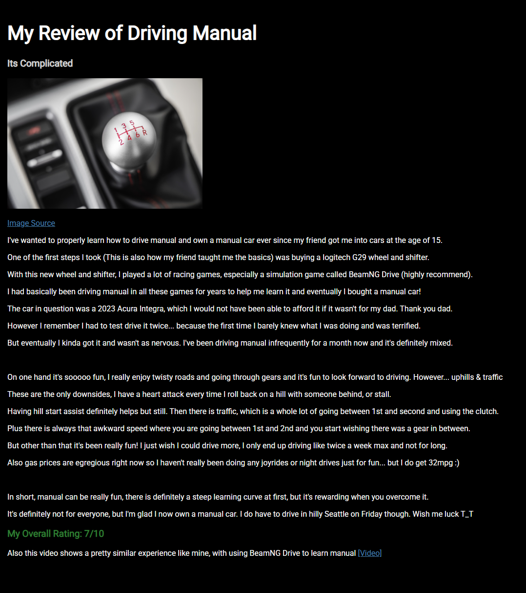

# HTML/CSS HW

## Screenshot

## Overview

This page is a public-facing review of learning to drive manual, written and styled using HTML and CSS. The review covers my experience going from practicing in racing simulators with a Logitech G29 to eventually buying a 2023 Acura Integra.

The page includes a left side image, a rating, formatted paragraphs, and links to an image source and a related YouTube video. Styling is handled through an external CSS file using a Google Font, color adjustments, and both class and ID selectors.

## Links

- Image Source: https://www.thecarconnection.com/tips/technology/1088392_how-to-drive-a-stick-shift-the-basics

- Related Video: https://www.youtube.com/watch?v=IA8GoePAnxg
